## 黑白图像上色项目文档
---

一、项目概览
---

生成对抗网络（Generative Adversarial Network）是一种深度学习模型，是近年来复杂分布上无监督学习最具前景的方法之一。

自2014年生成对抗网络被提出以来，GAN网络如今被应用到了多种场景中：
- 图像生成，如超分辨率任务、语义分割
- 数据增强：用GAN生成的数据扩展数据集，做数据增强
- 图像翻译：将图像转换为另一种形式的图像
- 图像合成：如场景合成、人脸合成、文本到图像的合成（根据文字生成图像）、风格迁移等
- 图像域的转换：如换脸、换衣等
- 图像修复
- ……

卷积神经网络之父Yann Le Cun评价GAN网络是“机器学习这二十年来最酷的想法”。

本项目使用基于cGAN提出的pix2pix算法，完成对黑色图像自动上色的任务。


二、基本理论
---
### 2.1、参考文献

> [Ian J. Goodfellow, Jean Pouget-Abadie, Mehdi Mirza, et, al. “Generative Adversarial Networks” 10 Jun 2014, cs.LG: arXiv:1406.2661](https://arxiv.org/abs/1406.2661)

### 2.2、GAN的基本架构

GAN网络模型通过至少两个模块：`生成器`（Generator）和`判别器`（Discriminator）的互相博弈学习产生良好的输出。在GAN理论中，生成器 `G` 和判别器 `D` 并不需要都是神经网络，只要能模拟相应的生成和判别函数即可。但是在实际应用中，我们一般以神经网络作为生成器和判别器。

[Ian J. Goodfellow](https://zh.wikipedia.org/wiki/%E4%BC%8A%E6%81%A9%C2%B7%E5%8F%A4%E5%BE%B7%E8%B4%B9%E6%B4%9B)等人在2014年提出的通过对抗过程生成模型的框架中讲到：框架中同时训练两个模型，分别是捕获数据分布的生成器G和估计样本来自训练数据的概率的判别器D。G的训练程序是将D的错误率最大化。这个框架对应一个最大值集下限的双方对抗游戏。可以证明在任意函数G和D的空间中，存在唯一的解决方案，使得G重现训练数据分布，而D=0.5。在G和D由多层感知器定义的情况下，整个系统可以用反向传播进行训练。在训练或者生成样本期间，不需要任何马尔科夫链或展开的近似推理网络。

### 2.3、GAN网络详解

我们以一个例子来继续探索GAN网络的算法本质：

在一个GAN网络中，生成器 G 需要给定某种隐含的信息，来随机产生观测数据；而判别器 D 则需要输入由 G 产生的数据，并给出预测结果，判断输入的数据是否来自于原始训练集。所以，简单来说，G 的任务是生成尽量和原始数据集处于同一分布的"假数据"，使 D 的判断最大程度的产生错误；而 D 的任务则是正确判断数据特征，让自己不被 G 产生的假数据骗过去。

我们来举个简单的例子：
- 生成器：给一系列猫的图片，生成一张新的猫咪图片，该图片不在原始数据集中
- 判别器：给定一张图片，判断这张图片是不是来自于原始数据集

根据GAN框架的基本理论可以知道，在我们的GAN框架中，有两个神经网络 G 和 D，它们的作用分别如下：
- G：生成图片，接收一个随机噪声z，通过这个噪声产生图片G(z)
- D：判别给定的图片是不是"真实图片"，它的输入是一张图片，输出D(x)表示x为真实图片的概率，如果为1，表示这一定是一张真实图片；如果为0，表示这一定不是真实图片。

在整体的训练过程中，G 致力于生成真实图片去欺骗 D，而 D 则想办法提高自己判别图片的准确度。如此以来，G 和 D 二者就构成了一个动态博弈的过程。

这个动态过程在达到最理想的状态时，生成器 G 可以生成完全能够以假乱真的图片 G(z)；而对于判别器 D 来说，它则无法判断 G 生成的图片到底是不是来自于原始数据集的真实图片，这时判别器判断出错的概率 D(G(z)) = 0.5。

在最理想状态下的生成器 G 就是我们所需要的能够完成任务的模型。

Goodfellow从理论上证明了GAN框架算法的收敛性，以及在模型收敛时，生成数据具有和真实数据相同的分布，保证了模型的效果。因此最初的GAN模型也被称为`GoodfellowGAN`

### 2.4、公式解读

GAN框架的目标函数如下：

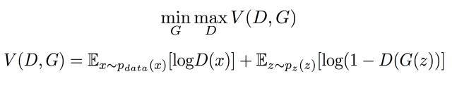

在公式中，x表示真实图片，z表示输入 G 网络的噪声，G(z)表示 生成器 G 生成的图片，D(·)表示判别器 D 给出的图片是否真实的概率。

> 判别器 D 的目的是增大目标函数 V 的值，生成器 G 的目的是减小目标函数 V 的值

#### 2.4.1、固定 G 不变，训练 D ：

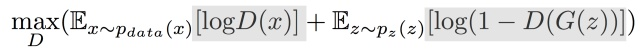

##### 训练 D 使得上面的公式最终结果尽可能的大。

我们知道，对于真实数据，D(x)会接近于1；而对于生成数据，D(x)则接近于0，则有：
- 某真实数据被判错，则 log(D(x)) << 0，第一项的期望值会接近负无穷
- 某生成数据被判错，则 log(1 - D(G(z))) << 0，第二项的期望值接近负无穷

因此当数据被分错的时候，会出现负无穷，模型可以优化的空间较大，可以通过调节参数使得目标函数 V 的数值增大。

#### 2.4.2、国定 D 不变，训练 G

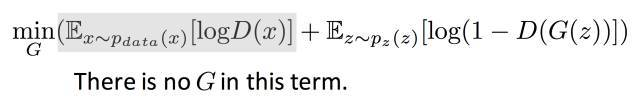

##### 训练 G 使得上面公式的最终结果尽可能的小

因为我们已经固定了 G 不变，因此可以看到在上图中，目标函数的第一项和 G 是无关的，是一个常数，将其忽略。训练 G 的时候，我们希望判别器 D 在判断的时候尽量将其给出的数据判断为1，于是有：

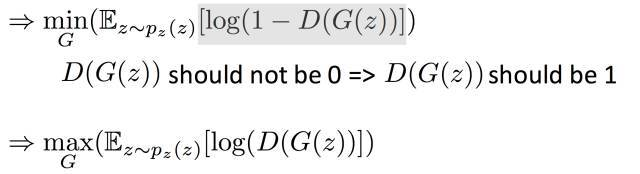

第二个式子其实是和第一个式子等价的，我们在训练的时候选择第二个式子的形式，其训练效果比较好。

#### 2.4.3、目标函数 V 可以收敛且存在全局最优解

证明目标函数可以收敛且有全局最优解时，需要使用`KL-散度`的概念，证明过程较为繁杂，在此不做进一步详解。需明白的是，我们首先固定 G 优化 D，得到 D 的最优情况为：

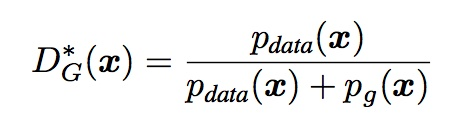

在确定了 D 的最优情况的状态下，G 想得到最优解的条件是：G 产生的分布和真实分布一致：

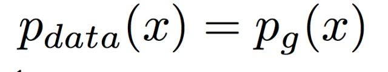

##### 因此当 G 产生的数据和真实数据处于同一分布时，目标函数取得最小值，存在最优解，此时 D(x) = 0.5

<br>

通过下面两张图：

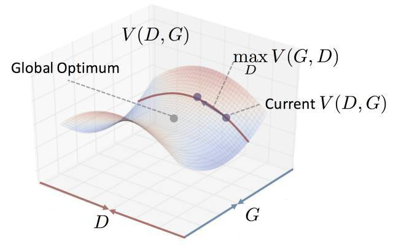 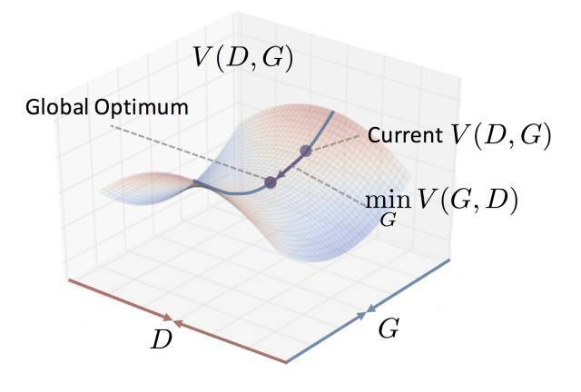

##### 可以看到目标函数可以收敛，且在训练过程中也能够收敛。

三、项目模型
---

### 3.1、参考文献
> [Phillip Isola, Jun-Yan Zhu, Tinghui Zhou, Alexei A. Efros. “Image-to-Image Translation with Conditional Adversarial Networks” 26 Nov 2018, cs.CV, arXiv:1611.07004 ](https://arxiv.org/abs/1611.07004)
>
>[Ting-Chun Wang, Ming-Yu Liu, Jun-Yan Zhu, et, al. "High-Resolution Image Synthesis and Semantic Manipulation with Conditional GANs", 20 Aug 2018, cs.CV, 	arXiv:1711.11585](https://arxiv.org/abs/1711.11585)
>
>[Han Zhang, Ian Goodfellow, et, al. "Self-Attention Generative Adversarial Networks", 14 Jun 2019, cs.LG, stat.ML,	arXiv:1805.08318](https://arxiv.org/abs/1805.08318)

### 3.2、pix2pix模型

pix2pix模型是基于cGAN实现的图像翻译算法，它也由生成器 G 和判别器 D 组成。对于pix2pix模型，它的 G 的输入是一张图片x，输出是一张图片y。但是 D 的输入有了一些变化，因为除了要生成真实图片之外，还要保证生成的图像和输入图像是匹配的。

#### 3.2.1、损失函数

对于pix2pix模型，其判别器 D 的输入，由普通GAN模型生成 G 生成的图片编程了一个`损失函数`:


为了做对比，我们再训练一个普通的GAN，只让判别器 D 判断是否为真实图像：

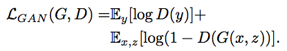

对于图像翻译任务来说，G的输入和输出之间共享了很多的信息，在图像上色过程中，输入和输出之间共享了边信息。因此，为了保证输入图像和输出图像之间的相似度，在pix2pix模型中还加入了L1 Loss：

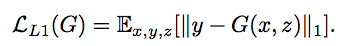

因此，对于判别器  D，总的损失函数如下：

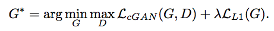

#### 3.2.2、生成器 G

在图像翻译中，输入和输出之间会共享很多的信息。如果在生成器中使用普通的神经网络，会导致每一层都记录保存的所有的信息，这样会导致神经网络很容易出错，因此，在生成器 G 中使用 U-Net 进行减负：

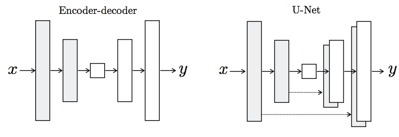

U-Net其实是一个 Encoder-Decoder 模型，而且两者是对称的。U-Net 是将第i层拼接到第n-i层，因为第i层和第n-i层图像大小一致，两者记录的信息是类似的。

#### 3.2.3、判别器 D

在损失函数里，pix2pix模型添加L1来保证输入和输出的共性，L1层可以防止图像的全局变形，因此我们只需要让 D 保证图片局部不会发生变形即可。

因此，pix2pix中的 D 以 Patch-D 来进行实现，无论生成的图像有多大，都将它切分成多个固定大小的patch输入到 D 中进行判断。这样做的好处很多：
- D 的输入变小，计算量小了很多，训练速度较快。
- G 本身是全卷积，对图像没有尺寸的限制，D 按照 Patch 的方法去处理图像，也对图像大小没有限制。使得整个pix2pix模型对图像大小没有限制，增大了框架的扩展性。

在本项目中，Patch 的大小为9像素。

### 3.3、pix2pixHD模型

pix2pixHD是pix2pix的重要升级，可以实现`高分辨率图像生成`和`图片的语义编辑`。对于GAN网络，学习的关键就是理解`生成器`、`判别器`和`损失函数`这三部分。pix2pixHD的生成器和判别器都是多尺度的，单一尺度的生成器和判别器的结构和pix2pix是一样的。损失函数由GAN loss、Feature matching loss和Content loss组成。

pix2pixHD模型的改进了如下两点:
- 高分辨率图片的生成
- 图片的语义编辑

#### 3.3.1、高分辨率图片的生成

在模型中使用如下方法进行训练来生成高分辨率的图片：
- coarse-to-fine的生成器
- multi-scale的判别器。在三个不同尺度上判别，取其平均。
- 更好的loss设计，总loss = GAN loss + Feature matching loss + Content loss。
- 使用Instance boundary map进行训练。

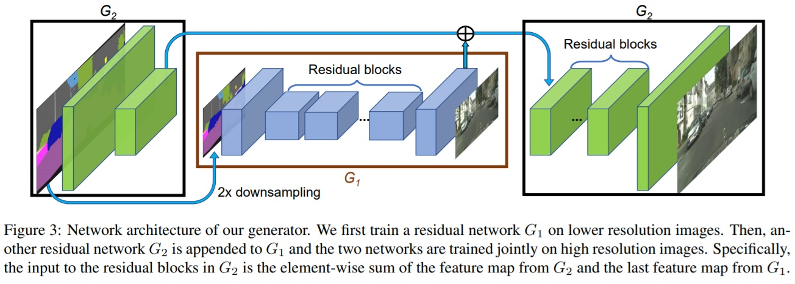

图片先经过一个生成器G2的卷积层进行2倍下采样，然后使用另一个生成器G1生成低分辨率的图，将得到的结果和刚刚下采样得到的图进行element-wise的相加，然后输出到G2的后续网络生成高分辨率的图片。

这么做的好处是，低分辨率的生成器会学习到全局的连续性（越粗糙的尺度感受野越大，越重视全局一致性），高分辨率的生成器会学习到局部的精细特征，因此生成的图片会兼顾局部特征和全局特征的真实性。如果仅使用高分辨率的图生成的话，精细的局部特征可能比较真实，但是全局的特征就不那么真实了。


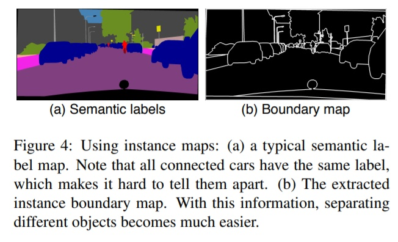

pix2pix使用语义分割图进行训练，但是对于同一类的相邻物体，例如图中的相连的汽车，它们之间是没有边界的，这样生成的时候会导致模糊。因此在pix2pixHD模型中使用实例分割的图进行训练，因为它包含了相邻同一类别的不同物体之间的边界，也可以说instance-level semantic label map包含了每一个物体的单独的ID。

通过对semantic label map的每一个像素进行扫描的方式来得到Instance boundary map，如果它和周围的四个像素的任意一个类别不一致，那么该像素位置为1，否则就是0。然后把Instance boundary map和semantic label map的one hot向量拼接，然后送到生成器里面。

从下图中可以看到添加了instance map的网络对紧挨着的相同类物体的生成更加真实:

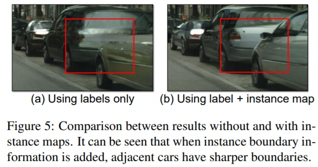

#### 3.3.2、图片语义编辑

从语义图到真实图的生成是一个一对多的映射，理想的模型应该可以根据同一个语义图生成`真实且多样`的图片。pix2pixHD的解决方法是在输入中`增加一个低维特征通道`:

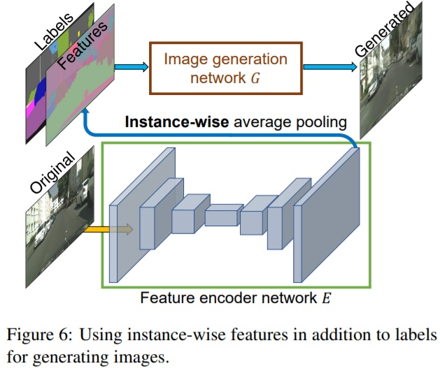

- 首先和GAN网络一起训练一个编码器。
- 原始图片经过编码器，然后进行instance-wise average pooling操作，对每一个目标实例计算平均特征(Features)，来保证每个目标实例特征的一致性。这个平均特征会被broadcast到该实例的每一个像素位置上。
- 输入图像比较多时，Features的每一类像素的值就代表了这类物体的先验分布。 使用编码器对所有训练图像提取特征，再进行K-means聚类，得到K个聚类中心，以K个聚类中心代表不同的风格。
- 在推理阶段，从K个聚类中心选择某一个，和语义标签信息、实例信息结合作为输入，这样就能控制颜色/纹理风格。

### 3.4、Self-Attention GAN模型

Han Zhang将 self attention 引入GAN，来建模长远的依赖关系。传统的 convolutional GAN（cGAN）由于卷积核的尺寸限制，只能捕获局部区域的关系；而在 self-attention GAN（自注意力GAN） 中，能够利用所有位置的信息。此外，该工作的另一个创新点为：对 GAN 生成器应用 spectral normalization。

self attention 机制能够利用较远的区域的信息，每个位置能够结合与该位置相似或相关区域的信息，确保生成的图片的区域一致性。

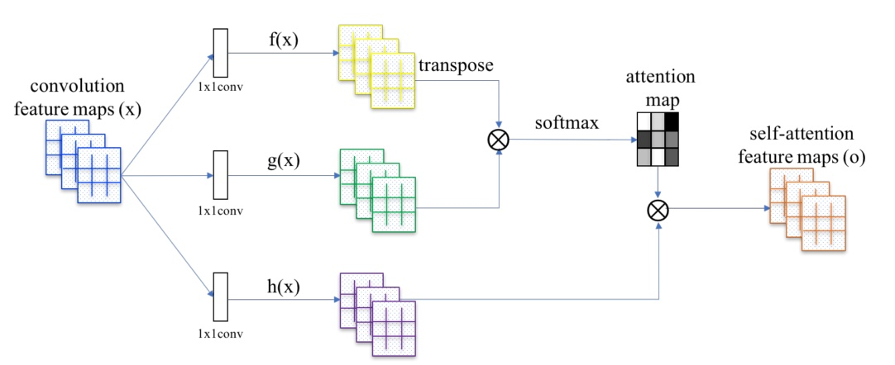

self attention 机制中对卷积的 feature maps 使用两个1\*1的卷积进行线性变换和通道压缩，然后对两个张量 reshape 成矩阵形式，转置相乘，再经过 softmax 得到 attention map。原 feature maps 再使用 1\*1 的卷积进行线性变换（通道数保持不变），然后与attention map矩阵相乘，相加，得到self-attention feature maps。最后，self-attention feature maps 和原卷积 feature maps 进行加权求和（权重参数是可学的），作为最后的输出。

### 3.5、具体实现

在本项目中，使用的生成器来自于 pix2pix 模型，判别器和损失函数来自于 pix2pixHD 模型，同时引用了 Self-attention GAN 中的 self attention 等优化机制。

#### 3.5.1、实现细节

- 使用16GB的 GPU 可以训练150张 128\*128 像素的图片，25张 256\*256 像素的图片
- 基于pix2pixHD模型的论文，对于不同的图像分辨率，使用3个判别器。
- 生成器具有一些内存问题，如有兴趣，可以使用keras中的原始生成器进行尝试。
- 可以使用[Yahoo's 100M images](https://webscope.sandbox.yahoo.com/catalog.php?datatype=i&did=67)和[Pixabay](https://pixabay.com/)扩展自己的数据集。
- 项目按照多GPU进行构建，但是已经给出的模型基于单GPU进行训练。

#### 3.5.2、项目运行

```sh
python colorize_base.py
```

#### 3.5.3、实验结果

通过训练，以下给出一张效果较好的最终实验图片：


